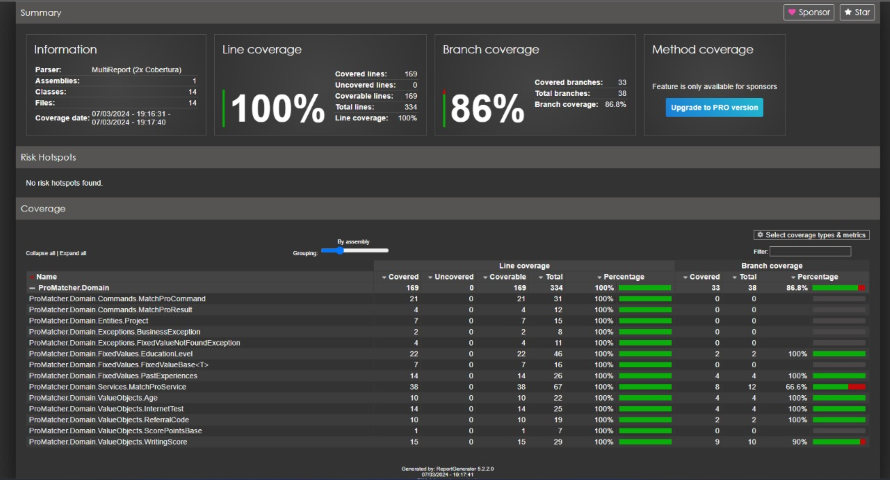

# cloudhumans-pro-matcher
Cloud Humans - Backend Take Home Assignment

---
### Setup

- Run the code
```sh
docker build -t pro-matcher-api .
docker run -p 8080:80 pro-matcher-api
```

- Run Tests (src/ProMatcher.Domain.Tests/run-tests.sh)
```sh
# Install dotnet-reportgenerator-globaltool
dotnet tool install -g dotnet-reportgenerator-globaltool

# Run tests
dotnet test --collect:"XPlat Code Coverage"

# Generate Coverage Report
reportgenerator "-reports:./TestResults/**/*.cobertura.xml" "-targetdir:TestResults/" "-reporttypes:HTML;"

# Report file: TestResults/index.html
```
---

### Technical decisions

1. **Design Patterns**: Using design patterns such as CQRS, Dependency Injection and Repository to keep the code organized, decoupled, and testable.

2. **Data Validation**: Validating user input data to ensure it is valid and secure before processing it.

3. **Error Handling**: Implemented consistent and effective error handling to deal with exceptions and return appropriate error responses to API clients.

4. **Automated Testing**: Wrote automated tests to validate the API's behavior in different scenarios and ensure its robustness and stability over time.

5. **Documentation**: Providing clear and comprehensive documentation for the API, including endpoint descriptions, input parameters, response status codes, and usage examples.
---

### Technical decisions in unit tests

1. **Mocking Dependencies**: I used the Moq library to create mock implementations of dependencies, such as `IReferralCodeRepository` and `IProjectRepository`. This allows us to isolate the code under test and focus exclusively on testing its behavior without involving the actual implementations of these dependencies.

2. **Test Coverage**: Using the Coverage Report for comprehensive test coverage by testing various scenarios and edge cases. This includes testing different combinations of input parameters and ensuring that the code behaves correctly under different conditions.



3. **Separation of Concerns**: Keeping unit tests focused on testing specific aspects of the code, such as testing individual methods or classes in isolation. This helps maintain clarity and readability of the tests.

4. **Test Naming**: I chose descriptive and meaningful names for the test methods to clearly indicate which behavior is being tested. This helps understand the purpose of each test and makes it easier to identify failures during test execution.
---

### TODO
- Possible "improvements" include implementing "Fast fail validation" and "Notification Pattern".
